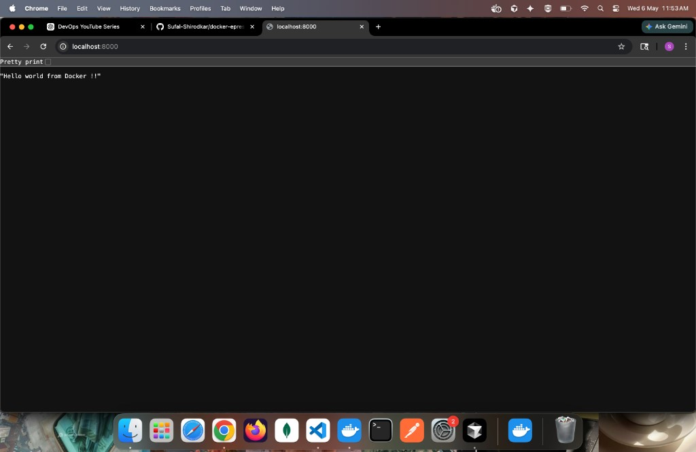
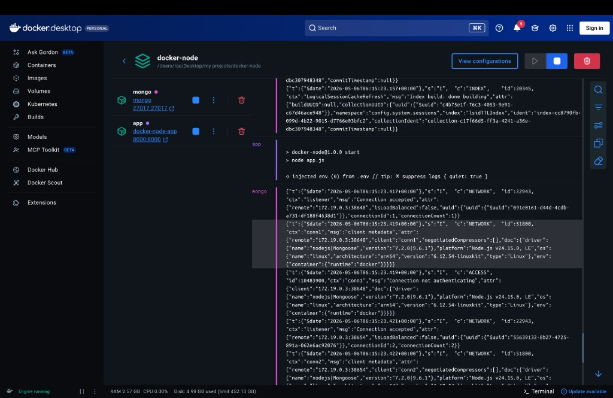
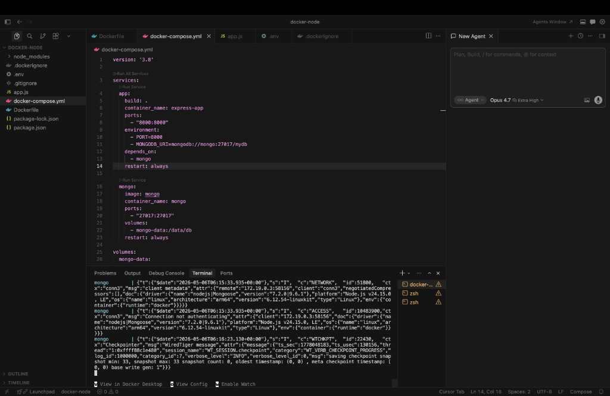
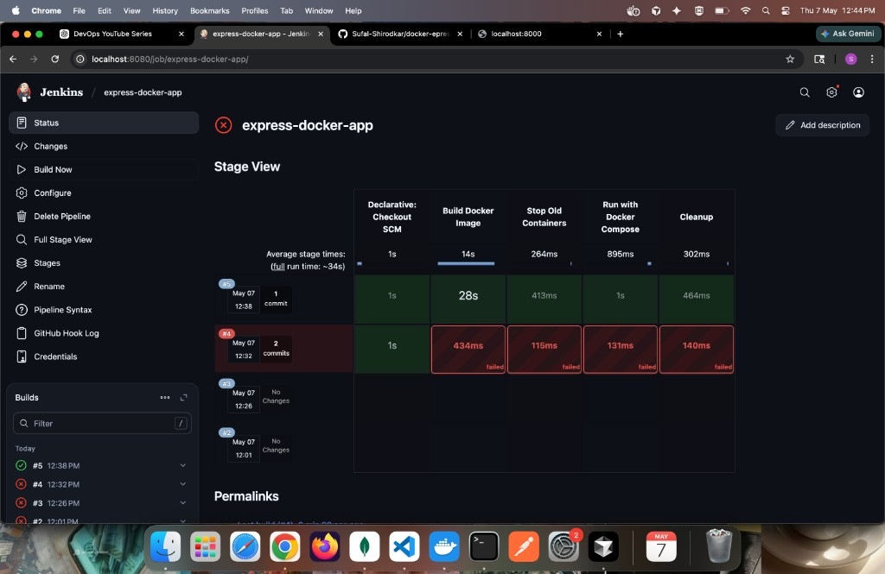
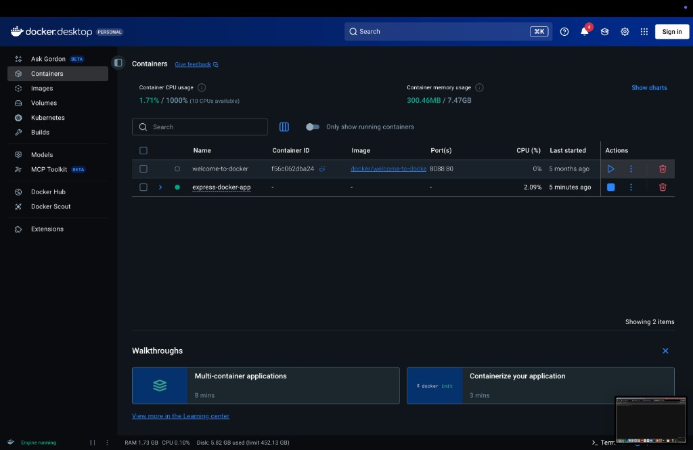
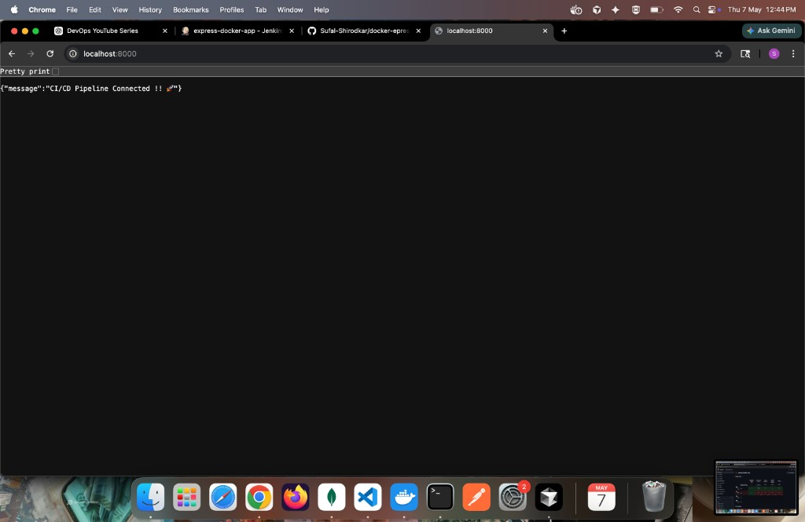

# Docker Express App

A simple **Node.js + Express + MongoDB** application containerized with **Docker**, orchestrated using **Docker Compose**, and continuously deployed via a **Jenkins CI/CD pipeline**. This project demonstrates how to run a Node.js API alongside a MongoDB database, both running as separate containers that communicate over a shared Docker network, and how to automate the build/deploy cycle with Jenkins.

---

## Tech Stack

- **Node.js 18** — JavaScript runtime
- **Express 5** — Web framework
- **Mongoose** — MongoDB ODM
- **MongoDB** — NoSQL database
- **Docker & Docker Compose** — Containerization
- **Jenkins** — CI/CD pipeline automation

---

## Project Structure

```
docker-node/
├── screenshots/          # README screenshots
├── .dockerignore         # Files ignored by Docker build
├── .env                  # Environment variables (not committed)
├── .gitignore
├── Dockerfile            # Image definition for the Node app
├── Jenkinsfile           # Jenkins CI/CD pipeline definition
├── app.js                # Express server entry point
├── docker-compose.yml    # Multi-container setup (app + mongo)
├── package.json
└── README.md
```

---

## Prerequisites

Make sure the following are installed on your machine:

- [Docker Desktop](https://www.docker.com/products/docker-desktop/) (includes Docker Engine + Docker Compose)
- [Node.js 18+](https://nodejs.org/) (only needed if you want to run the app locally without Docker)

---

## Environment Variables

Create a `.env` file in the project root:

```env
PORT=8000
MONGODB_URI=mongodb://mongo:27017/mydb
```

> **Note:** When running through Docker Compose, the hostname `mongo` resolves to the MongoDB container automatically. If you run the app outside Docker, change it to `mongodb://localhost:27017/mydb`.

---

## Getting Started

### 1. Clone the repository

```bash
git clone <your-repo-url>
cd docker-node
```

### 2. Build and start the containers

```bash
docker-compose up --build
```

This command will:

- Build the Node.js image from the `Dockerfile`
- Pull the official `mongo` image
- Start both containers (`express-app` and `mongo`)
- Connect them on a shared network

### 3. Verify the app is running

Open your browser and visit:

```
http://localhost:8000
```

You should see the response below:



---

## Running Containers

Once `docker-compose up` is running, both containers should appear in **Docker Desktop**:



You can also see live logs for both the app and MongoDB directly inside VS Code:



---

## API Endpoints

| Method | Endpoint | Description                       |
| ------ | -------- | --------------------------------- |
| GET    | `/`      | Returns a CI/CD confirmation JSON |

Example response:

```json
{ "message": "CI/CD Pipeline Connected !! 🚀" }
```

---

## CI/CD with Jenkins

This project ships with a `Jenkinsfile` that defines a declarative pipeline. Every push to the configured branch triggers Jenkins to rebuild the Docker image, restart the containers, and clean up old images automatically.

### Pipeline stages

1. **Declarative: Checkout SCM** — pulls the latest code from GitHub
2. **Build Docker Image** — runs `docker build -t express-docker-app .`
3. **Stop Old Containers** — runs `docker compose down` to remove the previous deployment
4. **Run with Docker Compose** — runs `docker compose up -d --build --force-recreate`
5. **Cleanup** — runs `docker image prune -f` to remove dangling images

### Setting up the pipeline in Jenkins

1. In Jenkins, click **New Item → Pipeline** and name it `express-docker-app`.
2. Under **Pipeline → Definition**, choose **Pipeline script from SCM**.
3. Set **SCM** to `Git` and **Repository URL** to your GitHub repo.
4. Set **Branch Specifier** to the branch you want Jenkins to track (e.g. `*/development`).
5. Set **Script Path** to `Jenkinsfile`.
6. Save and click **Build Now**.

### macOS gotcha — `docker: command not found`

When running Jenkins on macOS, the daemon does **not** inherit your shell's `PATH`, so it can't find Docker (which lives at `/usr/local/bin/docker` on Intel Macs or `/opt/homebrew/bin/docker` on Apple Silicon). The `Jenkinsfile` in this repo fixes this by prepending the Docker path to the pipeline's `PATH`:

```groovy
environment {
    PATH = "/usr/local/bin:${env.PATH}"
}
```

### Successful build

After the fix, all stages turn green:



### Container deployed by Jenkins

The `express-docker-app` container running in Docker Desktop after a successful pipeline run:



### Live API response from the deployed app



---

## Useful Docker Commands

```bash
# Start containers in the background
docker-compose up -d

# Stop the containers
docker-compose down

# Stop and remove volumes (clears MongoDB data)
docker-compose down -v

# View logs
docker-compose logs -f

# Rebuild after code changes
docker-compose up --build
```

---

## How It Works

- The **`app`** service is built from the local `Dockerfile`, exposes port `8000`, and depends on the `mongo` service.
- The **`mongo`** service uses the official MongoDB image and persists data using a named volume (`mongo-data`) so your database survives container restarts.
- Both services run on the same default network created by Docker Compose, allowing the app to reach MongoDB using the hostname `mongo`.
- **Jenkins** watches the configured branch on GitHub. On every push it rebuilds the image, recreates the containers via Docker Compose, and prunes old images — giving you a fully automated deploy on every commit.

---

## License

ISC
